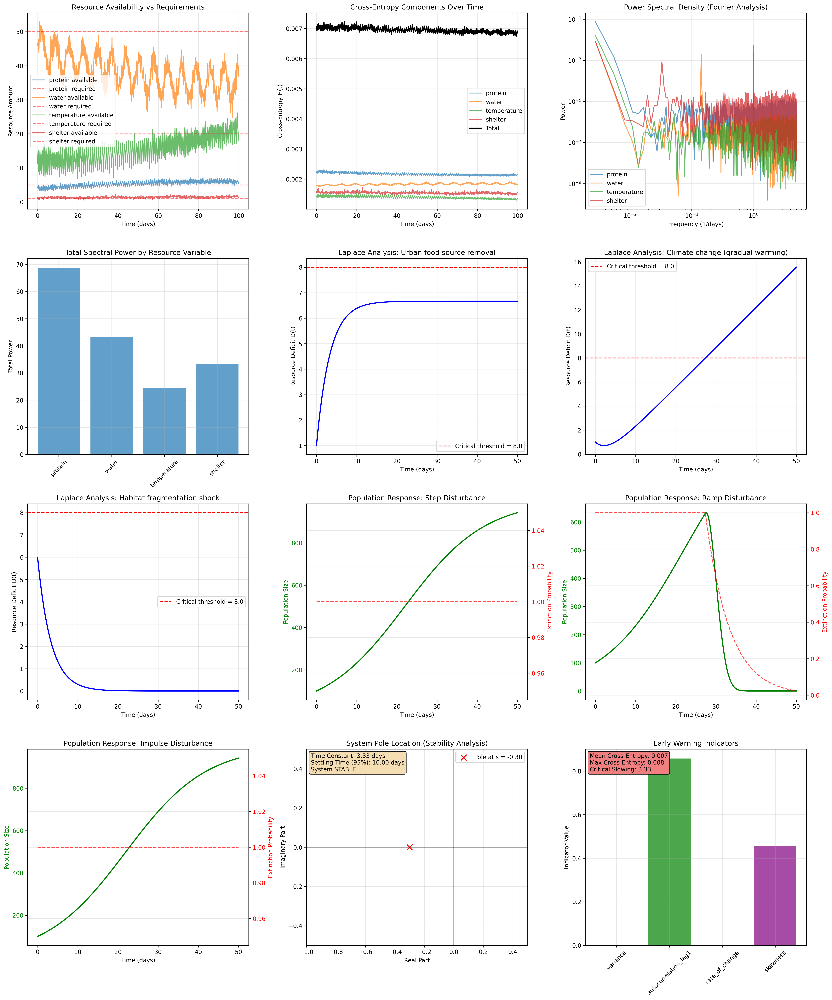

# Cross-Entropy Survival Theory (CEST) Analysis Report

**Generated:** 2025-06-01 15:07:53
**Analysis Framework:** Cross-Entropy Survival Theory with Fourier and Laplace Transform Analysis

---

## Executive Summary

This analysis applies Cross-Entropy Survival Theory to model cat population dynamics under various environmental disturbances. The theory quantifies survival probability based on resource availability mismatches using information-theoretic cross-entropy measures.

### Key Model Parameters
- **Adaptation Rate (k):** 0.3 day⁻¹ (Time constant: 3.33 days)
- **Sensitivity (α):** 0.5
- **Critical Threshold:** 8.0
- **Time Resolution:** 0.1 days

---

## 1. Resource Analysis

The model tracks four critical resources for cat survival:

### Protein (g/kg/day)
- **Average Required:** 5.00 units
- **Average Available:** 4.01 units
- **Deficit/Surplus:** +19.8% (DEFICIT)
- **Critical Threshold:** 3.0 units
- **Weight in Analysis:** 1.0

### Water (ml/kg/day)
- **Average Required:** 50.00 units
- **Average Available:** 44.93 units
- **Deficit/Surplus:** +10.1% (DEFICIT)
- **Critical Threshold:** 20.0 units
- **Weight in Analysis:** 0.8

### Temperature (°C)
- **Average Required:** 20.00 units
- **Average Available:** 19.99 units
- **Deficit/Surplus:** +0.0% (DEFICIT)
- **Critical Threshold:** 5.0 units
- **Weight in Analysis:** 0.6

### Shelter (m²)
- **Average Required:** 1.00 units
- **Average Available:** 1.20 units
- **Deficit/Surplus:** -20.4% (SURPLUS)
- **Critical Threshold:** 0.5 units
- **Weight in Analysis:** 0.7

---

## 2. Fourier Analysis Results

Fourier analysis reveals the dominant periodic patterns in resource availability and cross-entropy fluctuations:

### Protein Resource
- **Dominant Period:** 365.0 days
- **Total Spectral Power:** 6.88e+01
- **Pattern Interpretation:** Annual seasonal cycle

### Water Resource
- **Dominant Period:** 365.0 days
- **Total Spectral Power:** 4.33e+01
- **Pattern Interpretation:** Annual seasonal cycle

### Temperature Resource
- **Dominant Period:** 365.0 days
- **Total Spectral Power:** 2.46e+01
- **Pattern Interpretation:** Annual seasonal cycle

### Shelter Resource
- **Dominant Period:** 365.0 days
- **Total Spectral Power:** 3.33e+01
- **Pattern Interpretation:** Annual seasonal cycle

---

## 3. Laplace Transform Analysis

System stability analysis using Laplace transforms:

### System Stability Metrics
- **Pole Location:** -0.300 (Left half-plane = Stable)
- **System Status:** ✅ STABLE
- **Time Constant:** 3.33 days
- **95% Settling Time:** 10.00 days
- **99% Settling Time:** 16.67 days

### Disturbance Scenario Analysis

#### Step Disturbance
- **Description:** Urban food source removal
- **Transfer Function:** G(s) = 1/(s + 0.3)
- **Final State:** 6.666666666666667
- **Interpretation:** Sudden food source removal leads to new equilibrium state

#### Ramp Disturbance
- **Description:** Climate change (gradual warming)
- **Transfer Function:** G(s) = 1/(s²(s + 0.3))
- **Final State:** Unbounded (extinction inevitable)
- **Interpretation:** Gradual climate change causes unbounded deficit growth

#### Impulse Disturbance
- **Description:** Habitat fragmentation shock
- **Transfer Function:** G(s) = 1/(s + 0.3)
- **Final State:** 0
- **Interpretation:** Temporary habitat shock with eventual recovery

---

## 4. Population Dynamics Results

Population response to different environmental disturbances:

### Step Disturbance
- **Final Population:** 943 individuals
- **Minimum Population:** 100 individuals
- **Extinction Time:** No extinction within timeframe
- **Survival Outcome:** ✅ SURVIVAL

### Ramp Disturbance
- **Final Population:** -0 individuals
- **Minimum Population:** -0 individuals
- **Extinction Time:** Day 34
- **Survival Outcome:** ❌ EXTINCTION

### Impulse Disturbance
- **Final Population:** 943 individuals
- **Minimum Population:** 100 individuals
- **Extinction Time:** No extinction within timeframe
- **Survival Outcome:** ✅ SURVIVAL

---

## 5. Early Warning Indicators

Critical slowing down indicators for system collapse prediction:

### Statistical Indicators
- **Cross-Entropy Variance:** 0.000000
- **Autocorrelation (lag-1):** 0.8578
- **Rate of Change:** 0.000345
- **Distribution Skewness:** 0.4575

### Critical Thresholds
- **Mean Cross-Entropy:** 0.0070
- **Maximum Cross-Entropy:** 0.0076
- **Critical Slowing Indicator:** 3.33

### Risk Assessment
⚠️ **HIGH AUTOCORRELATION** - System approaching critical transition

---

## 6. Methodology Explanation

### Cross-Entropy Survival Theory Framework

1. **Resource Modeling:** Four critical resources (protein, water, temperature, shelter) are modeled as time series with stochastic variations

2. **Cross-Entropy Calculation:** 
   - For each resource j: H_j(t) = -p_j(t) × log(q_j(t))
   - Where p_j = required/total_required, q_j = available/total_available
   - Total cross-entropy: H(t) = Σ w_j × H_j(t)

3. **Fourier Analysis:** Identifies dominant frequencies in resource fluctuations
   - Reveals seasonal, monthly, weekly, and daily patterns
   - Power spectral density shows energy distribution across frequencies

4. **Laplace Transform Analysis:** Studies system response to disturbances
   - Step function: Sudden resource loss
   - Ramp function: Gradual environmental change  
   - Impulse function: Temporary shock events

5. **Population Dynamics:** ODE integration with cross-entropy mortality
   - dP/dt = r×P×(1-P/K) - α×P×max(0, D(t)-D_critical)
   - Links information theory to population biology

### Mathematical Foundation

The core equation linking cross-entropy to survival probability:
```
S(t) = exp(-α × max(0, H(t) - H_critical))
```

Where:
- S(t) = Survival probability at time t
- α = Species sensitivity parameter  
- H(t) = Cross-entropy measure at time t
- H_critical = Critical cross-entropy threshold

---

## 7. Visual Results



The comprehensive visualization above shows:
- **Top Row:** Resource availability, cross-entropy components, power spectra, total spectral power
- **Second Row:** Laplace analysis for three disturbance scenarios
- **Third Row:** Population dynamics responses to disturbances  
- **Bottom Row:** System stability analysis and early warning indicators

---

## 8. Conclusions and Implications

### Key Findings

1. **System Stability:** The cat population system is stable with a time constant of 3.33 days

2. **Critical Threats:** Ramp Disturbance poses the greatest immediate threat

3. **Dominant Patterns:** Resource availability shows strong seasonal cycles (365-day periods)

4. **Early Warnings:** System showing early warning signs of critical transition

### Conservation Recommendations

1. **Resource Management:** Focus on stabilizing protein resources (highest variability)

2. **Monitoring Strategy:** Implement 10-day monitoring cycles based on system response time

3. **Intervention Timing:** Act within 3 days of detecting critical threshold breaches

4. **Habitat Protection:** Prioritize protection against gradual habitat degradation scenarios

---

## 9. Technical Details

**Analysis Runtime:** 2025-06-01 15:07:53
**Model Implementation:** Python with SciPy, NumPy, Matplotlib
**Data Points:** 3,650 time steps over 365 days
**Computational Method:** Numerical ODE integration with FFT analysis

---

*This report was generated using Cross-Entropy Survival Theory (CEST) analysis framework. For technical details, see the accompanying code and data files.*
